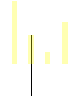

## **알고리즘 테스트 문제 010 - lv2 (30분)**

### **카테고리 : 이분탐색(Binary Search)**

### **문제 설명**  

나무 M미터가 필요해 목재절단기를 구입해 직접 벌목을 하고자 합니다.  
목재절단기는 다음과 같이 동작합니다. 먼저 `절단기에 높이 H를 지정`해야 합니다. 높이를 지정하면 톱날이 땅으로부터 H미터 위로 올라갑니다. 그 다음, 한 줄에 연속해있는 나무를 모두 절단해버립니다. 따라서, **높이가 H보다 큰 나무는 H 위의 부분이 잘릴 것이고, 낮은 나무는 잘리지 않을 것입이다.** 예를 들어, 한 줄에 연속해있는 나무의 높이가 `20, 15, 10, 17`이라고 하자. `높이를 15로 지정했다면`, 나무를 자른 뒤의 높이는 `15, 15, 10, 15`가 될 것이고,` 길이가 5인 나무와 2인 나무를 들고 집에 갈 것입니다.` (총 7미터를 집에 들고 갑니다)  

나무를 필요한 만큼만 집으로 가져가려고 합니다. 이때, 적어도 M미터의 나무를 집에 가져가기 위해서 절단기에 설정할 수 있는 높이의 최댓값을 return하는 solution함수를 작성하세요.



### **입출력 예제**

집으로 가져가려고 하는 나무의 길이 M이 주어진다.  

나무들의 높이가 주어진다. 나무의 높이의 합은 항상 M을 넘기 때문에, 집에 필요한 나무를 항상 가져갈 수 있다.  


**Input Format**
```json
{
    "m" : 7,
    "tree" : [20, 15, 10, 17]
}
```

**Output Format**
```json
{
    "m" : 7,
    "tree" : [20, 15, 10, 17],
    "output" : 15
}
```