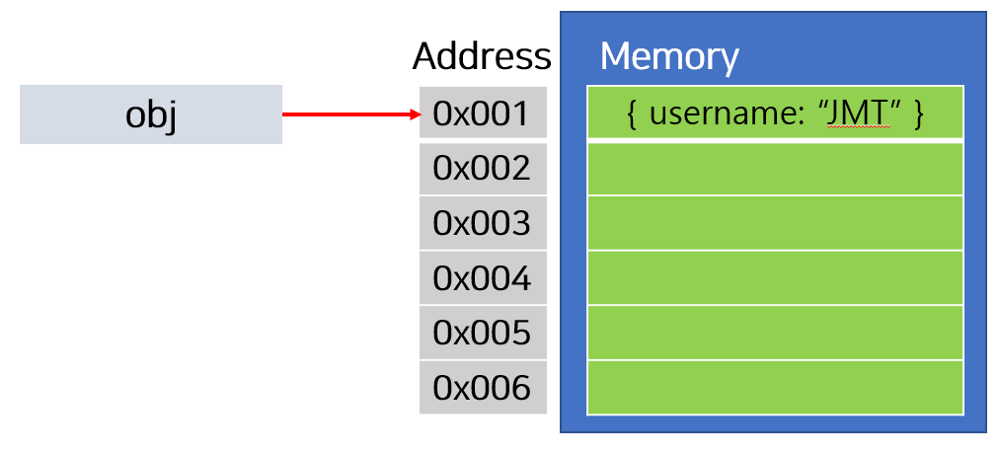
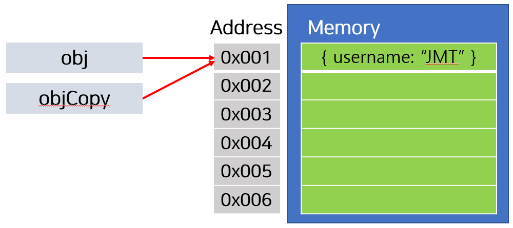
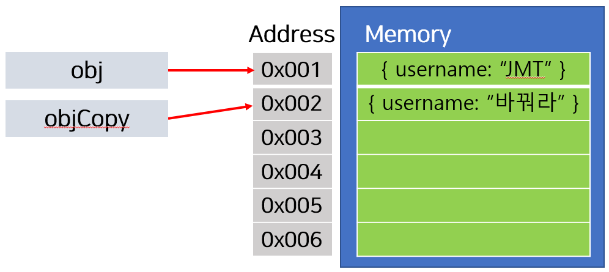

# **알고리즘이란?**

## **알고리즘은 어떠한 문제를 해결하기 위한 일련의 절차를 공식화한 형태로 표현한 것이다.**

> ### 프로그래밍에서 알고리즘은 `입력`을 통해 우리가 원하는 `출력`을 얻기 위한 계산 과정을 의미한다. 이러한 문제를 해결할 때, 정확하고 효율적으로 결과값을 얻기 위해서 알고리즘이 필요하다.

- 명확성 : 실행과정이 명확하고 모호하지 않은 코드로 작성돼야 한다.
- 효율성 : 어떠한 크기의 데이터가 입력되더라도 효율적으로 처리가 가능해야한다.


## **시간복잡도(Time Complexity)**

### 알고리즘의 소요 시간을 정확히 평가할 수는 없으므로, 자료의 수 n이 증가할 때 시간이 증가하는 대략적인 패턴을 시간 복잡도라는 이름으로 나타내게 된다. 이를 `Big-O 표기법(Big O notation)`으로 주로 나타낸다. 


### Big-O표기법 에서 주로 사용되는 표기법은 아래 그래프와 같다.


## **Javascript 기초 :**

argument를 전달하는 방식에 따라 함수 호출 방법은 크게 두가지로 나눠집니다. 

`Call By Value`와 `Call By Reference`입니다. 그러면, 자바스크립트는 어떤 방식으로 함수를 호출할까요?  
바로 Call By Value입니다. 흔히들 잘못 알고 있는 사실이 한가지 있습니다.  
바로 함수의 parameter가 `원시타입(Primitive Type)`인 경우에는 `Call By Value`고, parameter가 Object type이면 `Call By Reference` 로 동작한다는 것입니다.  
이는 완전히 잘못된 사실입니다. 검색해보면, 이렇게 잘못된 사실을 바탕으로 쓰여진 글을 쉽게 찾아볼 수 있습니다.


### **원시타입 (Primitive Type)**

| Primitive Type |
| :------------- |
| boolean        |
| number         |
| string         |
| null           |
| undefined      |

함수의 argument로 원시타입(Primitive Type)의 값이 전달되면, 함수가 실행될때 전달받은 argument를 복사합니다.  
argument가 복사되었기 때문에 전달된 argument와 전달받은 argument는 전혀 다른 값(주소값이 다른)이 됩니다. 코드로 확인해 보겠습니다

```javascript
function change(obj) {
    pri = "바꿔라"
}

const initData = "JMT";
change(initData);
console.log(`initData : ${initData}`); //
```

변수 initData 에 `"JMT"` 이 할당된 다음, change 함수의 argument로 initData가 전달되었습니다.  
change 함수내에서는 parameter pri에 `"바꿔라"` 을 할당하여 값을 변경시킵니다. change 함수가 호출된 이후 log를 찍어보면,  
initData 값은 change 함수가 호출되기 전과 동일하게 `"JMT"`이 됩니다. 즉, 처음 선언한 initData와 change 함수로 전달한  
argument는 별도의 값으로 존재한다는 뜻입니다.


### **재할당 (Reassigning of Reference Type)**

주소값을 직접 확인할 방법이 없기 때문에 `===` 연산자로 reference가 동일한지 비교해보도록 하겠습니다.

```javascript
let obj = { username : "JMT" };
let objCopy = obj;
console.log(obj === objCopy)

objCopy = { username : "바꿔라" }
console.log(obj === objCopy)
```

obj 라는 객체를 선언합니다. 그리고 objCopy 에 obj 를 할당합니다. 좀더 자세히 알아보기 위해 임의의 주소값으로 표현해보겠습니다.








objCopy의 주소값이 변경되었습니다. objCopy 는 원래 `0x001라는 주소값`을 value로 가지고 있었습니다. 그런데, 새로운 객체를 할당했더니 주소값이 변경되었습니다. 그 이유는 `{ username : "바꿔라" }`이라는 Object 는 새로운 주소로 만들어집니다. 그리고 기존에 잇던 objCopy 라는 변수에 할당했으므로, 이제 objCopy 는 `0x002 주소값`을 가리키게 되었습니다. 


## **정리**

### Javsciprt에서 함수 호출시 `call by value`로 함수가 호출되면 전달한 argument가 복사됨을 뜻합니다. 인자가 복사되기 때문에 원시타입(primitive type)의 경우에는 함수 바깥의 변수와 서로 별개로 동작합니다. 

### 하지만, array를 포함한 Objec가 argument로 전달된 경우에는 변수에 할당되어 있는 Object의 주소값이 복사됩니다. 그래서 함수내에서 parameter의 속성을 변경하면 함수 바깥에서도 동일하게 변경되는 것입니다. 그런데, 만약 함수내에서 parameter가 재할당되었다면, 함수 바깥의 변수와 함수내 parameter가 서로다른 Object를 바라보게 됩니다. 그래서 함수 내부에서 아무리 Object를 변형시키더라도 외부의 Object에 영향을 줄 수 없습니다.


# **네 가지 흔한 자바스크립트 메모리누수**

## **1. 전역변수**

자바스크립트는 흥미로운 방식으로 선언되지 않은 변수를 처리합니다. 선언되지 않은 변수가 참조되면 전역 객체에 새로운 변수를 생성하는 것입니다. 브라우저상이라면 전역 객체는 `window`가 됩니다. 따라서,


```javascript
function foo() {
    bar = "some text";
}
```


```javascript
function foo() {
    window.bar = "some text";
}
```


다른 함수 내에 있지 않은 foo를 호출하면 this는 글로벌 객체(window)를 가리킴
```javascript
function foo() {
    this.var1 = "potential accidental global";
}

foo();
```


자바스크립트 파일의 상단에 `use strict`를 사용하면 위와 같은 모든 것들을 회피할 수 있습니다. 이 모드에서 자바스크립트는 예상치 못한 전역 변수 생성을 방지할 수 있는 훨씬 엄격한 파싱을 시도합니다.


기대치 않게 생성된 전역변수는 물론 문제입니다만 많은 경우에는 의도적으로 가비지컬렉터가 정리할 수 없는 전역변수를 사용하기도 합니다.  
임시로 정보를 저장하거나 많은 양의 정보를 처리할 때 사용하는 전역 변수에 특별히 세심한 주의를 기울일 필요가 있습니다.  
꼭 그래야 한다면 전역 변수를 사용할 수도 있지만 사용을 마친 다음에는 꼭 null로 할당하거나 다른 변수로 할당하시기 바랍니다.