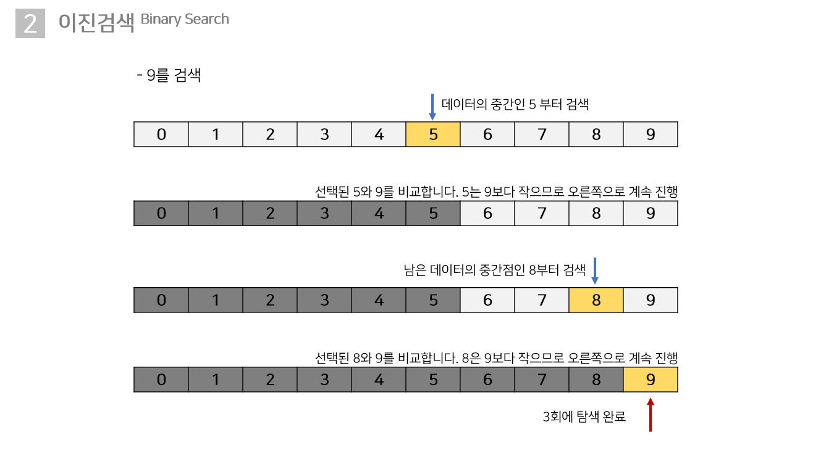

# **정렬(Sorting)과 검색(Search)**

정렬은 

## **검색(Search)**

### **선형검색(Linear search)**

`선형검색(Linear search)`은 주어진 데이터 내에서 원하는 데이터를 찾을때까지 처음부터 차례로 검색하는 알고리즘입니다 다른이름으로 `순차검색(Sequential Search)`이라고도 합니다.

데이터를 정렬하거나 따로 건드릴 필요가 없고, 난이도가 쉬운 편이나, 데이터의 양이 많아지면 검색에 소요되는 시간도 비례하여 많아지고, 하나씩 일일이 비교하기 때문에 비효율적이라는 단점이 있습니다. 예를들어 위와 같은 데이터의 집합이 있을경우 8을 찾으려면 10번의 비교를 거쳐야 합니다. 100만개의 데이터가 있고 찾고자 하는 데이터가 100만번째에 있다면 100만번의 비교를 해야 한다는 뜻 입니다. 이와 같은 상황을 `Worst Case`라고 합니다. 관련된 용어로 평균적인 상황을 `Average Case` 좋은 상황을 `Best Case`라고 합니다.

### **이진검색(Binary Search)**

이진검색은 다른말로 `이분(二分)검색`이라고도 합니다. 선형검색(Linear search)의 경우 데이터 집합의 처음에서 시작하여 끝까지 탐색하는 알고리즘 이지만 이진검색(Binary Search)은 중간값부터 탐색을 합니다. 검색 범위를 반으로 나누어 원하는 데이터를 찾을때까지 계속 검색합니다.

이진검색은 데이터를 계속 반으로 나누면서 연산하기 때문에 처리속도가 매우 빠르다는 장점을 가지고 있습니다. 그러나 `이진검색을 하기 위해서 데이터의 집합이 반드시 정렬(Sort)되어야 한다`는 단점이 있습니다. 

이렇게 이야기하면 얼마나 빠른지 감이 잘 안올텐데, 예를들어 70억명의 사람중 한사람을 찾으려고 한다면, 선형검색은 Worst Case의 경우 70억번, 대략적으로 생각해도 35억번은 비교연산을 해야 하는데, 이진 검색은 최대 33번의 비교만으로도 원하는 데이터를 찾을 수 있습니다.

선형검색과 마찬가지로 10개의 방에 0부터 9까지의 데이터가 담겨 있는 배열입니다. 이야기 했다시피 이진검색의 조건은 데이터가 정렬이 되어있어야 된다는 점이기 때문에, 정렬을 진행했다 가정하고 0부터 9까지 순차적으로 적었습니다. 9라는 데이터를 찾기위해 어떤 연산과정을 거치는지 한번 알아보도록 하겠습니다.

자료구조

트리구조

이진트리 검색

AVL트리의 메커니즘

균형트리와 B트리